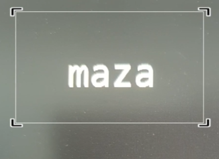

Facil implementación de OCR en Android Studio con Kotlin o Java


1) Implementamos en setting gradle

```kotlin

allprojects {
    repositories {
        ...
        maven { url 'https://jitpack.io' }
    }
}

```
2) Agregamos las siguiente dependencia

```kotlin
dependencies {

   	// If you want to additionally use the CameraX View class
   	implementation "androidx.camera:camera-view:1.3.0-alpha06"
   	// Camara Jhr
   	implementation 'com.github.jose-jhr:Library-CameraX:1.0.8'
    //Para el reconocimiento
    implementation 'com.google.mlkit:text-recognition:16.0.0'
}

```   

Configuraciones adicionales.
```kotlin

    buildFeatures{
    viewBinding = true
    }

```   

3) Creamos los objetos CameraJhr y Binding
```kotlin

    lateinit var cameraJhr: CameraJhr
    
    lateinit var vb: ActivityMainBinding
    
```

4) Iniciamos el objeto Camera Jhr

para mayor información visita el siguiente enlace. 

```kotlin

    //Inicializamos el objeto camara
    cameraJhr = CameraJhr(this)

```

5) Agregamos las vistas
```xml

<?xml version="1.0" encoding="utf-8"?>
<androidx.constraintlayout.widget.ConstraintLayout xmlns:android="http://schemas.android.com/apk/res/android"
    xmlns:app="http://schemas.android.com/apk/res-auto"
    xmlns:tools="http://schemas.android.com/tools"
    android:layout_width="match_parent"
    android:layout_height="match_parent"
    tools:context=".MainActivity">

    <androidx.camera.view.PreviewView
        android:id="@+id/cameraPreview"
        android:layout_width="match_parent"
        android:layout_height="500dp"
        app:layout_constraintEnd_toEndOf="parent"
        app:layout_constraintStart_toStartOf="parent"
        app:layout_constraintTop_toTopOf="parent"></androidx.camera.view.PreviewView>

    <TextView
        android:id="@+id/txtConsola"
        android:layout_width="match_parent"
        android:layout_height="0dp"
        app:layout_constraintBottom_toBottomOf="parent"
        app:layout_constraintEnd_toEndOf="parent"
        app:layout_constraintStart_toStartOf="parent"

        app:layout_constraintTop_toBottomOf="@+id/cameraPreview"></TextView>


</androidx.constraintlayout.widget.ConstraintLayout>

```


6) Iniciamos el objeto de reconocimiento 
```kotlin
        //Iniciamos el reconocimiento de texto
        textRecognizer = TextRecognition.getClient(TextRecognizerOptions.DEFAULT_OPTIONS)
        //adicion el atributo scroll a textConsol
        vb.txtConsola.movementMethod = ScrollingMovementMethod()
```

7) Reconocemos y mostramos
```Kotlin

  private fun startCameraJhr() {
        //tiempo antes de iniciar el proceso de reconocimiento
        var timeCurrent = System.currentTimeMillis()
        //tiempo de espera entre reconocimiento
        val timeWait = 1000L
        cameraJhr.addlistenerBitmap(object:BitmapResponse{
            override fun bitmapReturn(bitmap: Bitmap?) {
                
                //si ha pasado 1 segundo entonces, entramos a reconocer el bitmap
                if (System.currentTimeMillis()-timeCurrent >timeWait){
                    //convertimos el bitmap a InputImage
                    val image =  InputImage.fromBitmap(bitmap!!,0)
                    //reconocemos el texto que esta en la imagen
                    textRecognizer.process(image).addOnSuccessListener {
                        //mostramos el resultado en el textView
                       vb.txtConsola.text = it.text
                    }.addOnFailureListener {
                    }
                    timeCurrent = System.currentTimeMillis()
                }

            }
        })

        cameraJhr.initBitmap()
        cameraJhr.start(1,0, vb.cameraPreview,true,false,true)
    }


```

8) Que más se puede adicionar.

Puedo adicionar un recuadro de captura que me permita unicamente traducir lo que esta en el recuadro



Codigo completo: 

```Kotlin

package com.ingenieriajhr.testocr

import android.graphics.Bitmap
import androidx.appcompat.app.AppCompatActivity
import android.os.Bundle
import android.text.method.ScrollingMovementMethod
import com.google.mlkit.vision.common.InputImage
import com.google.mlkit.vision.text.TextRecognition
import com.google.mlkit.vision.text.TextRecognizer
import com.google.mlkit.vision.text.latin.TextRecognizerOptions
import com.ingenieriajhr.testocr.databinding.ActivityMainBinding
import com.ingenieriiajhr.jhrCameraX.BitmapResponse
import com.ingenieriiajhr.jhrCameraX.CameraJhr
import com.google.mlkit.vision.text.Text


lateinit var cameraJhr: CameraJhr

lateinit var vb: ActivityMainBinding

lateinit var textRecognizer: TextRecognizer

class MainActivity : AppCompatActivity() {
    override fun onCreate(savedInstanceState: Bundle?) {
        vb = ActivityMainBinding.inflate(layoutInflater)
        super.onCreate(savedInstanceState)
        setContentView(vb.root)

        //Inicializamos el objeto camara
        cameraJhr = CameraJhr(this)
        //Iniciamos el reconocimiento de texto
        textRecognizer = TextRecognition.getClient(TextRecognizerOptions.DEFAULT_OPTIONS)
        //adicion el atributo scroll a textConsol
        vb.txtConsola.movementMethod = ScrollingMovementMethod()


    }

    override fun onWindowFocusChanged(hasFocus: Boolean) {
        super.onWindowFocusChanged(hasFocus)
        if (!cameraJhr.ifStartCamera && cameraJhr.allpermissionsGranted()){
            startCameraJhr()
        }else{
            cameraJhr.noPermissions()
        }
    }

    private fun startCameraJhr() {
        //tiempo antes de iniciar el proceso de reconocimiento
        var timeCurrent = System.currentTimeMillis()
        //tiempo de espera entre reconocimiento
        val timeWait = 1000L
        cameraJhr.addlistenerBitmap(object:BitmapResponse{
            override fun bitmapReturn(bitmap: Bitmap?) {

                //si ha pasado 1 segundo entonces, entramos a reconocer el bitmap
                if (System.currentTimeMillis()-timeCurrent >timeWait){
                    //convertimos el bitmap a InputImage
                    val image =  InputImage.fromBitmap(bitmap!!,0)
                    //reconocemos el texto que esta en la imagen
                    textRecognizer.process(image).addOnSuccessListener {
                        //mostramos el resultado en el textView
                       vb.txtConsola.text = it.text
                    }.addOnFailureListener {
                    }
                    timeCurrent = System.currentTimeMillis()
                }

            }
        })

        cameraJhr.initBitmap()
        cameraJhr.start(1,0, vb.cameraPreview,true,false,true)
    }


}


```
